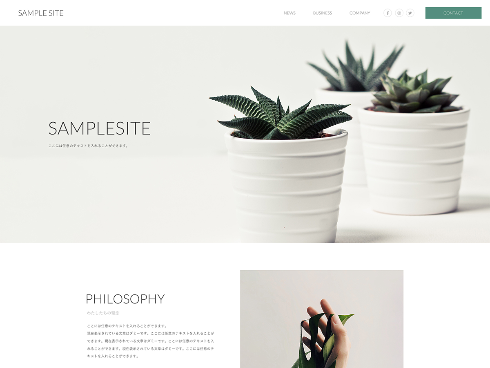
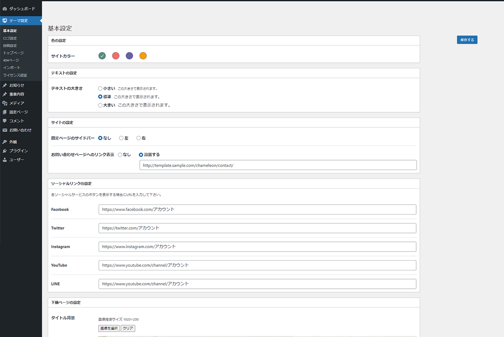
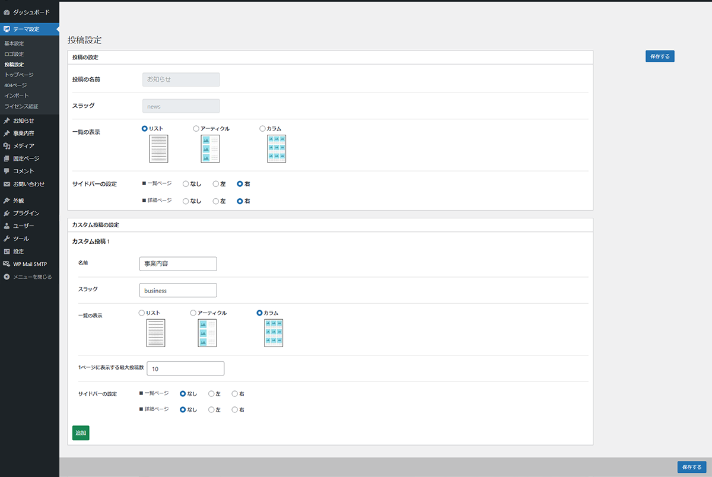
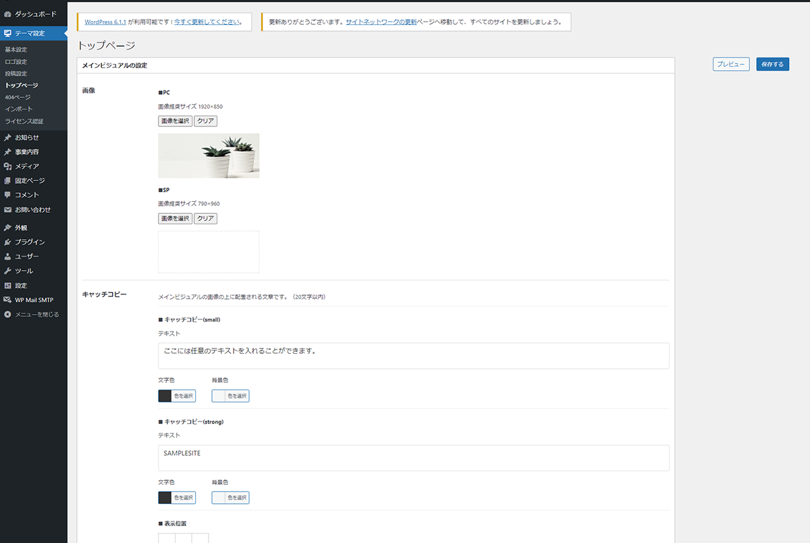
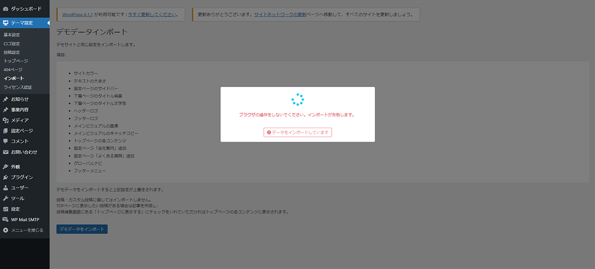
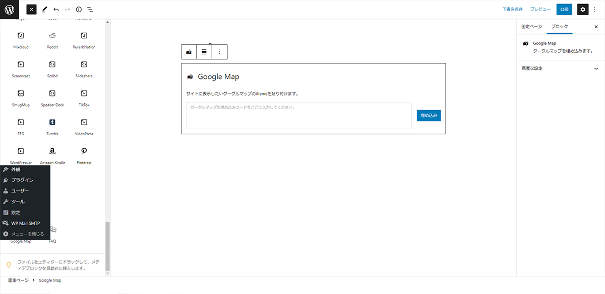

## ワードプレス オリジナルテーマ

## サイト概要
サイトレイアウトを柔軟にカスタマイズ可能にしたコーポレートサイト向けオリジナルテーマ。

## デモサイト
https://hwebsystem.com/chameleon/

## 使用技術
### フロントエンド
- HTML
- CSS（SCSS）
- JavaScript
- Bootstrap5
### バックエンド
- PHP 7.4
- Wordpress 6.0
### 開発環境
- Docker/Docker-compose
- webpack

## 機能
- レスポンシブ対応
- トップページビルダー
- テーマカラー設定
- カスタム投稿タイプ追加
- アーカイブページのレイアウト設定
- ロゴアップロード
- テキストサイズの設定
- ソーシャルサービスへのリンク設定
- サイドバーの表示設定
- Contact Form 7 対応
- ウィジェットのタイプの切り替え設定
- デモサイトの設定をインポート
- オリジナルブロックエディタ追加（googlemap、accordion）

